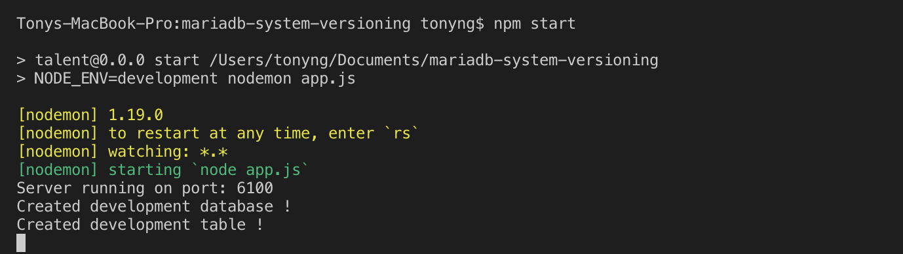
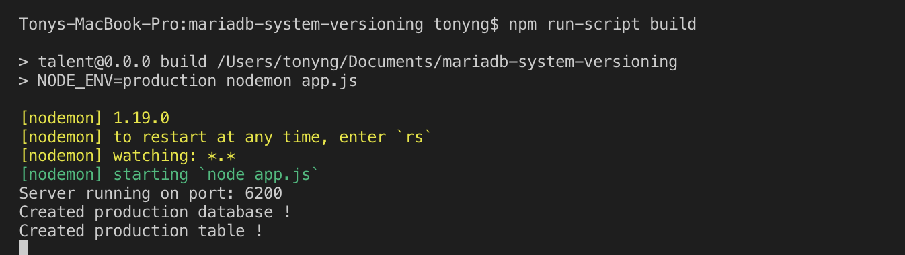

This will be my very first blog post after I embarked upon my software develop journey for almost 2 years. 
Hope you guys will enjoy it. 

##Learning Objective

By the end of this tutorial, you will learn
- **Part 1: [what is system versioning and how to modularize your set up environment for readability and testability](../system-versioning-part-1/)**
- Part 2: [how to implement system versioning test cases with NodeJS, Express and MariaDB](../system-versioning-part-2/)
- Part 3: [how to implement testing frameworks with Supertest, Mocha and Chai](../system-versioning-part-3/)

##Prerequisites

Before you join this tutorial, it is assumed that you meet the requirements listed below:

- NodeJS and MariaDB installed
- Basic understanding of NodeJS and middlewares like (Express, Koa)
- Knowledge of SQL and how to do CRUD a database
- a text editor of IDE of your choice

## What is System versioning?

System versioning is a method that allows users to create database that keep tracks the historical changes of 
data. That means when a user updates the database, the user will still be able to access the old data that has been changed or replaced.

## End result

We are going to build a simple version-controlled key-value store. The API should be able to:
- accept a key-value pair and store them. If an existing key is sent, the value should be updated.
- accept a key and return the corresponding value
- if given a key and a timestamp, return whatever the value at that time was. 

##Using MariaDB
The reason why I am opting for MariaDB for my use case is because MariaDB has a greater support for system versioning where it uses simplified syntax, and of course with its helpful documentation that helps developer with a great deal. You are welcome to use MySQL InnoDB Multi Versioning too, in fact I will be excited to see someone wrote an article on that.

If you have previously installed other MySQL servers on your laptop. Make sure you do a clean uninstall and install your MariaDB. If you are not sure how to do that, be sure to checkout 
([How to uninstall and install your MariaDB](https://gist.github.com/brandonsimpson/5204ce8a46f7a20071b5))

<adsense></adsense>

##Folder Structure

````
├── mariadb-system-versioning (main directory)   
    ├── node_modules
    ├── test
        ├── index.js
    ├── config
        ├── development.js
        ├── index.js
        ├── production.ejs
        ├── test.ejs
    ├── app.js    
    ├── routes.js
    ├── package-lock.json
    ├── package.json
````

##Creating the project directory

Type the following command in the terminal

```
mkdir mariadb-system-versioning
```


then change to the directory by typing
```
cd mariadb-system-versioning
```

##Initialize the project

In your terminal inside your project directory, type:
```
npm init
```

##Install the required modules

First, type the following:
```
npm i express body-parser morgan mysql --save
```
The installed modules are required to build the app:
- express: act as a middleware to handle routing and process request from the client
- body-parser: used to parse incoming request from the client by extracting its entire body portion and exposes it on req.body
- morgan: used to log request in terminal (even if server crashes)

This is optional, but you can type the following command to install the nodemon module globally in the PC:
```
npm i nodemon -g
```
I often likes to have nodemon installed to make sure changes to the server is being monitored and the server gets restarted automatically for any saved changes. 

##Working on the server side
Since this is about server-side implementation, there is no need to work on the front end. First, let's create our code environment for testing, development and production purposes under the config directory and export each of them as a module. 

```
<!--- /config/development.js --->

module.exports = {
  env: 'development',
  port: process.env.PORT || 6100
}

```

```
<!--- /config/production.js --->

module.exports = {
  env: 'production',
  port: process.env.PORT || 6200
}
```

```
<!--- /config/test.js --->

module.exports = {
  env: 'test',
  port: process.env.PORT || 6000
}
```

Easy stuff right? Now here comes the interesting part where we establish the connection to different database based on kind of environment we specify the server to run on.
```
<!--- /config/index.js --->

'use strict'

const mysql = require('mysql')
const env = process.env.NODE_ENV || 'development'
const config = require(`./${env}`)
const dbName = `${env}`
const createTable =
` 
  CREATE DATABASE IF NOT EXISTS ${dbName};
  USE ${dbName};
  CREATE TABLE IF NOT EXISTS talentTable(
    keyCol varchar(100) UNIQUE,
    valCol varchar(100)
  ) 
  WITH SYSTEM VERSIONING;
`

const db = mysql.createConnection({
  host: 'localhost',
  user: 'root',
  password: '',
  multipleStatements: true
})

db.connect(function (err) {
  if (err) throw err
  console.log(`Created ${dbName} database !`)
})

db.query(createTable, function (err, result) {
  if (err) throw err
  console.log(`Created ${dbName} table !`)
})

global.db = db
module.exports = config
```
The module 'mysql' is required for the connection to the database to be created. The mysql.createConnection takes in an object containing the database configuration to be connected to. 

Setting `multipleStatements` to true enable to write multiple SQL statements for the same query, which you would see in [Part 2](../system-versioning-part-2/)

Declaring the connection object as global object enables you to use it in anywhere in your code.

Notice that I am also creating an empty system-versioned table here. I will explain more of this in the later part.

The code above will run according to the NODE_ENV that you set. I am going to show you how you can set the environment in your package.json. But before that, let's also set up our entry point for the project in `App.js`.

```
'use strict'

const express = require('express')
const path = require('path')
const bodyParser = require('body-parser')
const logger = require('morgan')
const config = require('./config/index')
const app = express()

const {postObject, getObject} = require('./routes')

app.use(logger('dev'))
app.use(bodyParser.urlencoded({ extended: true }))
app.use(bodyParser.json())
app.use(express.static(path.join(__dirname, 'public')))

app.post('/object', postObject)
app.get('/object/:key', getObject)

app.listen(config.port, () => {
  console.log(`Server running on port: ${config.port}`)
})

module.exports = app
```

Open your package.json, and you can specify how you can run your server inside the scripts object. 
```
{
  "name": "talent",
  "version": "0.0.0",
  "private": true,
  "scripts": {
    "start": "NODE_ENV=development node app.js",
    "build": "NODE_ENV=production node app.js"
  },
  "dependencies": {
    "body-parser": "^1.19.0",
    "debug": "~2.6.9",
    "express": "~4.16.0",
    "morgan": "~1.9.0",
    "mysql": "^2.17.1"
  }
}
```
You can try running npm start and npm build now, and you should discover your console would show the database name and the port number accordingly like below:





So I have showed you how you can modularize your code at the very beginning. Why is modularization important? It is important not only for code readibility but also for ease of testing, which I am going to cover it in the third part of the tutorial next time.

To see how to implement the use case for system versioning with HTTP calls, let's go to Part 2:
[Create a System Versioning Database with MariaDB + NodeJS + Express + Supertest + Mocha + Chai (Part 2)](../system-versioning-part-2/)


