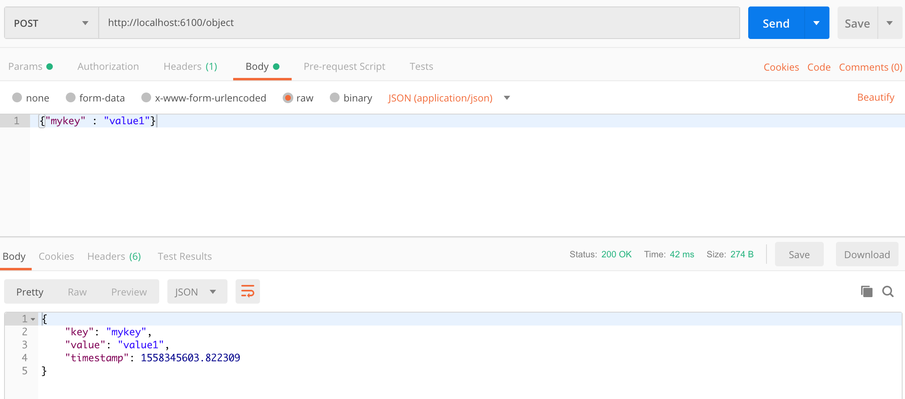
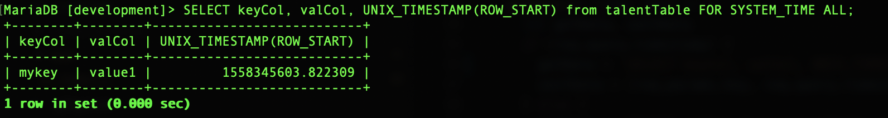
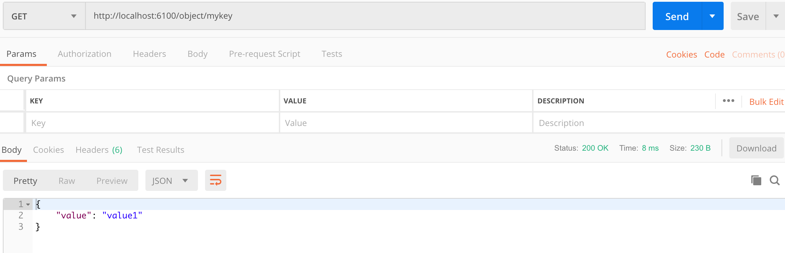
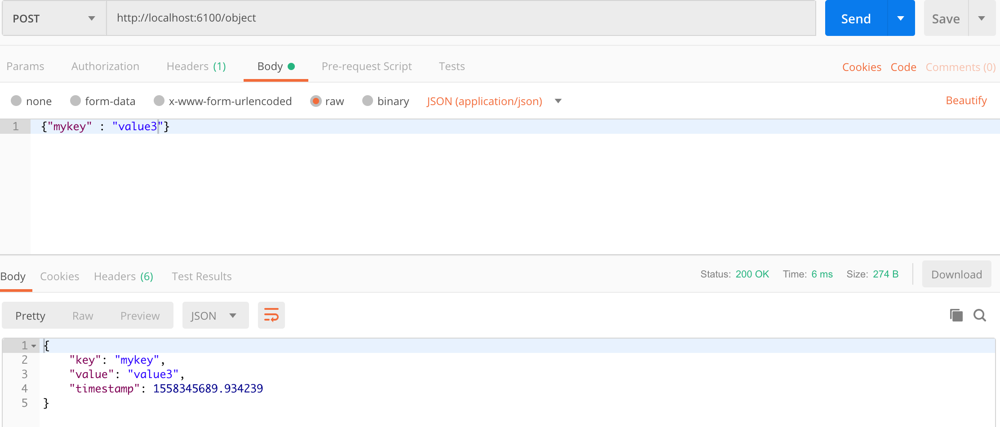
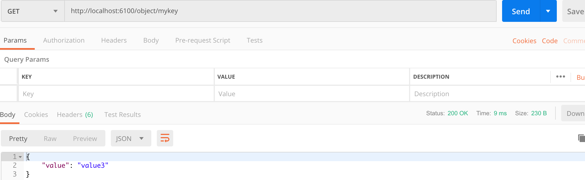
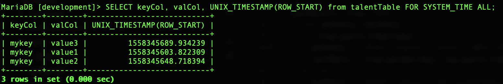
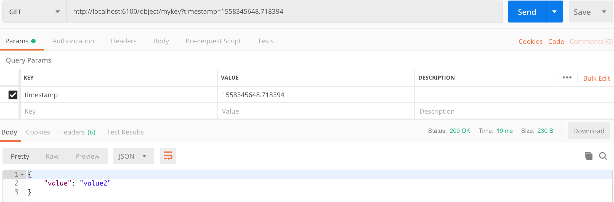
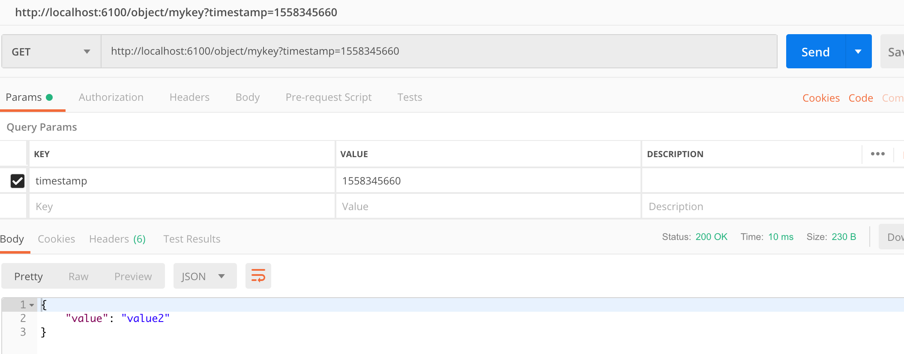

##Learning Objective

By the end of this tutorial, you will learn
- Part 1: [what is system versioning and how to modularize your set up environment for readability and testability](../system-versioning-part-1/)
- **Part 2: [how to implement system versioning test cases with NodeJS, Express and MariaDB](../system-versioning-part-2/)**
- Part 3: [how to implement testing frameworks with Supertest, Mocha and Chai](../system-versioning-part-3/)

##Prerequisites

Before you follow this article, make sure you have followed ([Create a System Versioning Database with MariaDB + NodeJS + Express + Supertest + Mocha + Chai (Part 1)](../system-versioning-part-1/))

##Begin to implement Restful API functions
For simplicity sake, we are going to implement just two types of HTTP calls, which are POST and GET. This should be sufficient for our requirements to produce the end result. For a revision of what is the requirement, please revisit [Part 1](../system-versioning-part-1/). Again, we are going to adhere to our modularization principle and wrap those two HTTP functions within the module export function so we are going to use them in our App.js file.

For POST purpose, we name its function as postObject.

For GET purpose, we name its function as getObject.

```
<!--- /routes.js --->

'use strict'

module.exports = {
  postObject: (req, res) => {
    
  },
  getObject: (req, res) => {

  }
}
```

##Implement postObject function
Let's start with the postObject function. 

We define the API endpoint for POST to be `/obj`. 

Then we set the request body to be as simple as:

```
{testkey: 'value1'}
```
Here we expect the response body to be 

```
{
  'key':'testkey',
  'value':'value1',
  'timestamp':time
}
```
The `time` refers to the time when the request object is being created in the database.

Well forget about ORMs for now, I am using raw SQL statements to demonstrate how to implement the test case.

For inserting a key-value pair into the table, write your statement as 
```
INSERT INTO talentTable(keyCol, valCol) VALUES (?) ON DUPLICATE KEY UPDATE valCol=?;
```
The `?` here will be the placeholder for us to insert into the database query function later. I would recommend using this placeholder method for writing secure dynamic SQL, instead of doing concatenation on values and strings as it could lead to wrong usage easily which is prone to malicious attacks by hackers.

To enable updating values given the same key, we use the feature of `ON DUPLICATE KEY UPDATE`.

You second statement here will be :
```
SELECT keyCol, valCol, UNIX_TIMESTAMP(ROW_START) from talentTable;
```

Doing this will enable you to access the versioning information via the `ROW_START` column. Wrapping it with `UNIX_TIMESTAMP` will convert the date format to unix time format.

Let's assign a constant to these two statements:
```
const createData =
    `
      INSERT INTO talentTable(keyCol, valCol) VALUES (?) ON DUPLICATE KEY UPDATE valCol=?;
      SELECT keyCol, valCol, UNIX_TIMESTAMP(ROW_START) from talentTable;
    `
```

Besides enabling inserting dynamic query statements, mysql connection object also allows you to insert dynamic values to be used in dynamic query. There were 2 dynamic values with placeholders we declared earlier. In order to use them in the query function, we have to put them in an array. Thus the query function would be:
```
db.query(createData, [values, value], (err, result) => {}
```

We handle the query error by setting the status to be 500, if no error, then we return the result according to the format we specified earlier in the article. The full code for the `postObject` function is be as below:
```
module.exports = {
  postObject: (req, res) => {
    let value, key
    for (let i in req.body) {
      value = req.body[i]
      key = i
    }
    const values = [key, value]
    const createData =
    `
      INSERT INTO talentTable(keyCol, valCol) VALUES (?) ON DUPLICATE KEY UPDATE valCol=?;
      SELECT keyCol, valCol, UNIX_TIMESTAMP(ROW_START) from talentTable;
    `
    db.query(createData, [values, value], (err, result) => {
      if (err) {
        res.status(500).json({ 'error': err, 'response': null })
        throw err
      } else {
        const length = result[1].length - 1
        res.status(200).json({
          'key': result[1][length].keyCol,
          'value': result[1][length].valCol,
          'timestamp': result[1][length]['UNIX_TIMESTAMP(ROW_START)']
        })
      }
    })
  }
}
```
##Implement getObject function
Next, let's continue with the getObject function.

We need to take care of two scenarios where the request is expecting the most updated data, or retrieving old data.

So let's design the endpoints according to the usecases. There will be two types of endpoint. One would be just `obj/testkey` without timestamp. Another one would be `obj/testkey?timestamp=1234567890`with timestamp for example.

Let's start with the simpler use case which is the one without timestamp. We just need to return the value from the key specified by the `testkey` request param:
```
`SELECT valCol from talentTable where keyCol IN (?)`
```

For the usecase with timestamp, here comes the tricky part. We need to return the value specified by the timestamp. But what if the timestamp specified in the url param is not found in the database? Well, we have to find the closest timestamp available and return the corresponding value.

I will show you the SQL statement used and then I will break it down and explain:
```
`SELECT valCol, UNIX_TIMESTAMP(ROW_START) from talentTable FOR SYSTEM_TIME ALL where keyCol IN (?) AND UNIX_TIMESTAMP(ROW_START) <= ? ORDER BY UNIX_TIMESTAMP(ROW_START) DESC LIMIT 1;`
```

Here, the 
```
SELECT valCol, UNIX_TIMESTAMP(ROW_START) from talentTable FOR SYSTEM_TIME ALL
```
will populate all data with corresponding `valCol` and `UNIX_TIMESTAMP(ROW_START)` columns and values. If the `SYSTEM_TIME ALL` clause is not stated, it will show only the current data, not all historical data changes. 

Next, the statement here:
```
where keyCol IN (?) AND UNIX_TIMESTAMP(ROW_START) <= ? ORDER BY UNIX_TIMESTAMP(ROW_START) DESC LIMIT 1;`
```
basically returns the closest timestamp value (or the timestamp value itself if exists). We set it to be DESC since the closest value should not be greater than the param value. We also limit to just `1` to return only one value.

Thus, the full code for the `routes.js` will be :

```
<!--- /routes.js --->

'use strict'

module.exports = {
  postObject: (req, res) => {
    let value, key
    for (let i in req.body) {
      value = req.body[i]
      key = i
    }
    const values = [key, value]
    const createData =
    `
      INSERT INTO talentTable(keyCol, valCol) VALUES (?) ON DUPLICATE KEY UPDATE valCol=?;
      SELECT keyCol, valCol, UNIX_TIMESTAMP(ROW_START) from talentTable;
    `
    db.query(createData, [values, value], (err, result) => {
      if (err) {
        res.status(500).json({ 'error': err, 'response': null })
        throw err
      } else {
        const length = result[1].length - 1
        res.status(200).json({
          'key': result[1][length].keyCol,
          'value': result[1][length].valCol,
          'timestamp': result[1][length]['UNIX_TIMESTAMP(ROW_START)']
        })
      }
    })
  },
  getObject: (req, res) => {
    let getData, sentData
    if (req.query.timestamp) {
      getData = `SELECT valCol, UNIX_TIMESTAMP(ROW_START) from talentTable FOR SYSTEM_TIME ALL where keyCol IN (?) AND UNIX_TIMESTAMP(ROW_START) <= ? ORDER BY UNIX_TIMESTAMP(ROW_START) DESC LIMIT 1;`
      sentData = [req.params.key, req.query.timestamp]
    } else {
      getData = `SELECT valCol from talentTable where keyCol IN (?)`
      sentData = req.params.key
    }
    
    db.query(getData, sentData, (err, result) => {
      if (err) {
        res.status(500).json({ 'error': err, 'response': null })
        throw err
      } else {
        res.status(200.json({'value': result[0].valCol})
      }
    })
  }
}

```

Let's try this out with Postman. First, let's try posting an object.



You can see that in Postman, it returns the posted key and value together with the timestamp of the object. Open up your terminal and go to MariaDB server, type: 
```
SELECT keyCol, valCol, UNIX_TIMESTAMP(ROW_START) from talentTable FOR SYSTEM_TIME ALL;
```
and you will see the table as above. 

Now, let's try retrieving the key value pair we just inserted into our database:


Let's try updating our database by posting the object with same key but different value (I updated two more times first with `value2` and then with `value3`):


Let's see whether the value is updated in our database!


You can also look at the system versioning database at server side:


Based on the table in the terminal above, let say we want to try retrieving the value at a specified timestamp for example:

So we inserted the exact timestamp value as in our database, and we get the value at that point of time.

But of course, we assume that users do not know the exact point of time when they made changes to the database. So what if the users select the timestamp that is maybe within the range of the timestamp of value2 and value3? Let's try.


Well, it returns value2 still. The behaviour is expected! So do we fulfill all requirements? What if you have many more requirements and you need to make sure everything works, it will be difficult foryou to keep going back and forth between your Postman and your program to check whether or not the program is working as expected. The recommended ways of designing APIs is to build automated testing tools and test each of your API, but even better, implement TDD instead. But of course, this tutorial series is not focusing on TDD but rather to give you an overview of how to implement system versioning with MariaDB.

To continue learning how to implement testing framework for this experiment. let's continue to Part 3:
[Create a System Versioning Database with MariaDB + NodeJS + Express + Supertest + Mocha + Chai (Part 3)](../system-versioning-part-3/)