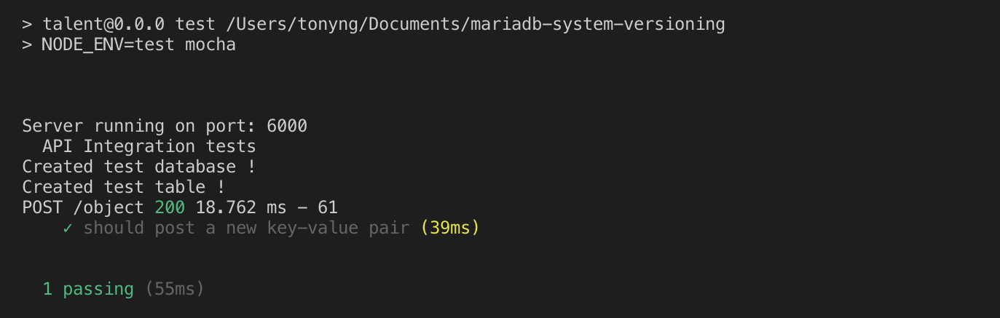
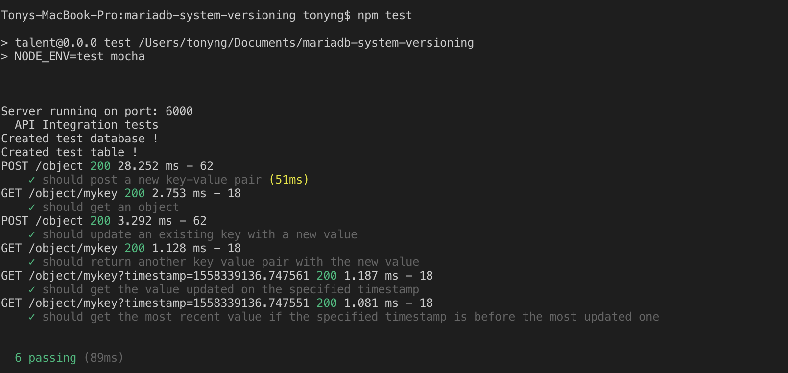

##Learning Objective

By the end of this tutorial, you will learn
- Part 1: [what is system versioning and how to modularize your set up environment for readability and testability](../system-versioning-part-1/)
- Part 2: [how to implement system versioning test cases with NodeJS, Express and MariaDB](../system-versioning-part-2/)
- **Part 3: [how to implement testing frameworks with Supertest, Mocha and Chai](../system-versioning-part-3/)**

##Prerequisites

Before you follow this article, make sure you have followed [Create a System Versioning Database with MariaDB + NodeJS + Express + Supertest + Mocha + Chai (Part 1)](../system-versioning-part-1/) + [(Part 2)](../system-versioning-part-2/).


##What is Testing?
Testing is the process of evaluating the system to check whether it produces expected result as being laid out in the requirements.

Note that TDD principle is not being laid out in this tutorial due to the fact that the focus of the tutorial is not on TDD itself. But I strongly encourage anyone to adapt TDD principle when writing your own codes.

##Types of testing
There are many types of software engineering testing such as unit testing, integration testing, functional testing,system testing, stress testing, performance testing, usability testing, and acceptance testing. However we will be using integration testing for our usecase.

Integration testing is a level of software testing where individual parts or units are combined and tested as a group. The purpose of using integration testing is to expose faults in the interaction between integrated units if they exist. 

##Testing Tools
There are three testing libraries we need for our use case. 
1. Supertest: required for testing API calls.
2. Mocha: A testing framework that enables you to test functions in a specified order, and logs their results in the terminal accordingly. It also provides structure to the tests by batching them into test suites or test cases.
3. Chai: An assertion library that is often used along side Mocha. It provides the base component of tests cases which are assertion. Assertions are tied to particular values and will fail if the expected value does not meet the actual value.

Before we begin, let's install the modules required for testing
```
npm i supertest mocha chai--save-dev
```

After installing, create directory called `test` and inside the directory create a file and name it `index.js`. Thie file will be the place where we write our tests.

First, we need to make some functions available, such as the exported `app.js` , Chai and Supertest by :


```
'use strict'

const app = require('../app')
const chai = require('chai')
const request = require('supertest')

```

Let chai expect api to be a constant we are going to use regularly later to enforce DRY, and write the tests. 

Generally, a test suite is a collection of all tests relating to a single functionality or behaviour. A test case is a single description of the expected behaviour that either passes or fails. Test suites are batched within the `describe` keyword and test cases are include in the `it` keyword. This follows a design pattern for Behaviour-Driven Development(BDD). You can read more about it [here](https://stackoverflow.com/questions/16206894/does-has-special-meaning-in-mocha).


Let's write our first API test to test the `/obj` endpoint. If this endpoint works correctly, it should return status code 200 to indicate success. That is how our routes.js file was implemented (See [Part 2](../system-versioning-part-2/)). 

```
'use strict'

const app = require('../app')
const chai = require('chai')
const request = require('supertest')
const expect = chai.expect

const data = (task) => {
  for (let i in task) {
    return {
      value: task[i],
      key: i
    }
  }
}

describe('API Integration tests', () => {
  let task = {'mykey': 'value1'}
  const initialData = data(task)
    it('should post a new key-value pair', (done) => {
      request(app)
        .post('/obj')
        .send(task)
        .end((err, res) => {
          expect(res.statusCode).to.equal(200)
          expect(res.body).to.have.property('key', initialData.key)
          expect(res.body).to.have.property('value', initialData.value)
          expect(res.body.timestamp).to.be.a('number')
          done()
        })
    })
})
```

The `describe` here is actually from Mocha test framework. I simply name the test as `API Integration tests` but you can use other name, just to be sure it reflects the purpose of the test. Here I declared a task object with the original key value pair I plan to begin the test with, and I assigned it as an argument inside the `data` function which I declared outside of the test suites. This function will be useful for me across the tests as I need to always return the object and the key.

Since request() needs the HTTP server so we pass our express app as an argument here . Then in `post` function , we specify the route endpoint. We use the send function to send `task` as the body. Within the `.end()` callback, we leverage on chai assertion methods to test whether the status returns 200. We also check for whether the returned results contain both key with name: `mykey` and value:`value1`. Lastly we also check whether there is a timestamp field that returns a number.

Right so far so good. But how do we run the test? Remember in [Part 1](../system-versioning-part-1/) where you have set up the test environment with modularity? In Part 1, you have set up the testing port as well. But you hae not set up the script to run it. Here is how we are going to  do it.

Open your package.json, and add make the change:

```
"scripts": {
  "start": "NODE_ENV=development nodemon app.js",
  "build": "NODE_ENV=production nodemon app.js",
  "test": "NODE_ENV=test mocha"
}
```
Now you can run the test by running the following command in your terminal:
```
npm run test
```

In your terminal, you can see:


Let's continue writing more testcases for both endpoints:

```
'use strict'

const app = require('../app')
const chai = require('chai')
const request = require('supertest')
const expect = chai.expect

const data = (task) => {
  for (let i in task) {
    return {
      value: task[i],
      key: i
    }
  }
}

describe('API Integration tests', () => {
  let task = {'mykey': 'value1'}
  const initialData = data(task)
    it('should post a new key-value pair', (done) => {
      request(app)
        .post('/obj')
        .send(task)
        .end((err, res) => {
          expect(res.statusCode).to.equal(200)
          expect(res.body).to.have.property('key', initialData.key)
          expect(res.body).to.have.property('value', initialData.value)
          expect(res.body.timestamp).to.be.a('number')
          done()
        })
    })
    it('should get an object', (done) => {
      request(app)
        .get(`/obj/testkey`)
        .end((err, res) => {
          expect(res.statusCode).to.equal(200)
          expect(res.body).to.have.property('value', initialData.value)
          done()
        })
    })
    it('should update an existing key with a new value', (done) => {
      task = {'mykey': 'value2'}
      const updatedData = data(task)
      request(app)
        .post('/obj')
        .send(task)
        .end((err, res) => {
          expect(res.statusCode).to.equal(200)
          expect(res.body).to.have.property('key', updatedData.key)
          expect(res.body).to.have.property('value', updatedData.value)
          expect(res.body.timestamp).to.be.a('number')
          task = res.body
          done()
        })
    })
    it('should return another key value pair with the new value', (done) => {
      request(app)
        .get(`/obj/testkey`)
        .end((err, res) => {
          expect(res.statusCode).to.equal(200)
          expect(res.body).to.have.property('value', task.value)
          done()
        })
    })
    it('should get the value updated on the specified timestamp', (done) => {
      request(app)
        .get(`/obj/testkey?timestamp=${task.timestamp}`)
        .end((err, res) => {
          expect(res.statusCode).to.equal(200)
          expect(res.body).to.have.property('value', 'value2')
          done()
        })
    })
    it('should get the most recent value if the specified timestamp is before the most updated one', (done) => {
      request(app)
        .get(`/obj/testkey?timestamp=${task.timestamp - 0.00001}`)
        .end((err, res) => {
          expect(res.statusCode).to.equal(200)
          expect(res.body).to.have.property('value', 'value1')
          done()
        })
    })
})
```

Run the test file with npm test command again and you will see an output like the following:



You can checkout the fullcode at my [Github](https://github.com/tonystaark/MariaDBsystemVersioning)